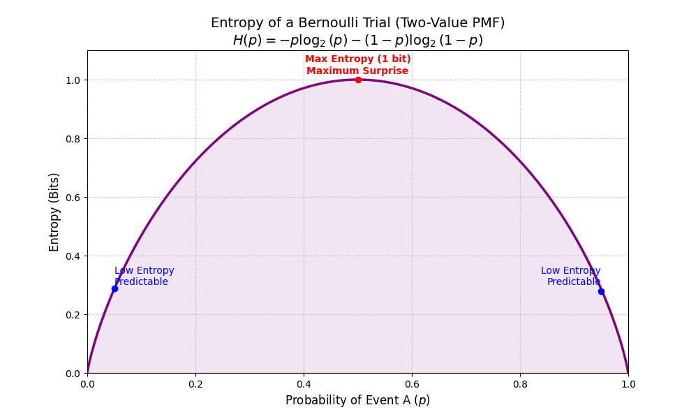
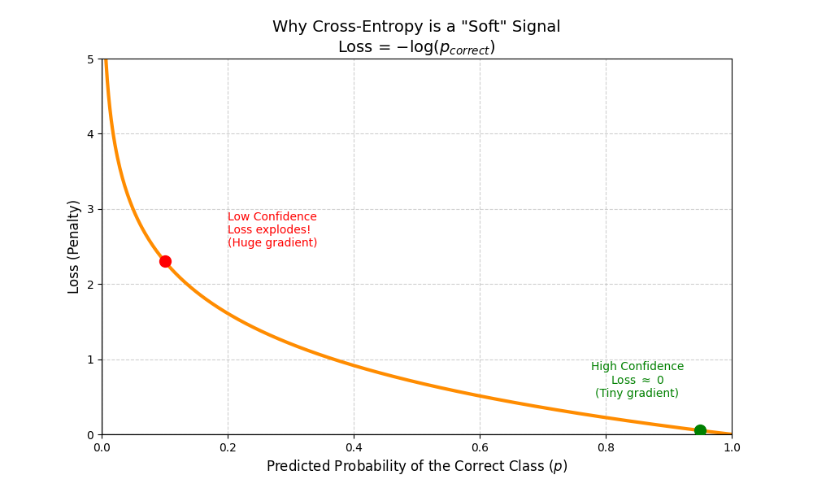
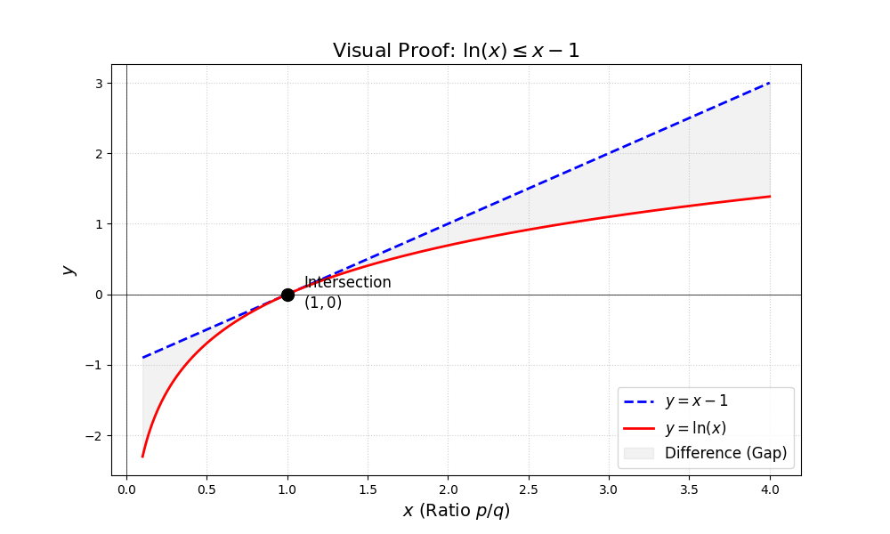

# Classification

Classification is where you are trying to predict a class membership (discrete) of data point(s). The decision is what class an input belongs to.

In this case, we will use a simple, intuitive, and effective loss (or definition of error) known as **0-1 loss**:

$$L(y, Y) = \begin{cases} 1 & \text{if } y \neq Y \\ 0 & \text{otherwise} \end{cases}$$

In particular for classification, we can break the expectation of the loss down into the probability of each class and the loss for that class:

$$\min_y \sum_i P(y_i = Y | x) \cdot L(y_i, Y)$$

Now to optimize this, let's consider that only one classification is correct (that is, it's exclusive), and for that one, the loss is $0$. Otherwise, the rest of the loss is simply the sum of the posterior misclassifications. In which case, it's plain to see that the minimum will be to pick the largest posterior—where in a sense you are zeroing out the biggest part of the loss.

So, decision theory proves that picking the maximum posterior $P(Y|X)$ minimizes error. But how do we find those posteriors?

1. **Generative models** try to assume the distribution of the likelihood $P(X|Y)$ and use the data to estimate priors, applying Bayes' rule to compare posteriors across classes (ignoring the shared denominator $P(X)$):

   $$P(Y|X) = \frac{P(X|Y)P(Y)}{P(X)}$$

   * LDA and QDA assume per-class Gaussian distributions as an example.
   * Their success depends heavily on how good your model of the likelihood is. For example, images of real objects are complex, high-dimensional non-Gaussians, making them difficult for simple generative assumptions.

2. **Discriminative models** skip modeling the feature density $P(X|Y)$ entirely and try to learn the parameters of a model that directly outputs the posterior (or the decision boundary) via function approximation.
   * Deep learning is a primary example of this.
   * They can be incredibly flexible; the Universal Approximation Theorem states that Neural Networks can learn any continuous function.
   * There are two main types: likelihood-optimization based (e.g., logistic regression, neural networks) and geometrically-optimization based (e.g., Support Vector Machines).
      * Interestingly, you can view likelihood optimization as a generative model that simply assumes the empirical distribution (a discrete PMF for the data where each point has a $1/N$ weight).

While we could try to optimize this probability with discriminative models using other metrics (like Mean Squared Error), Maximum Likelihood Estimation (MLE) is the standard in Deep Learning for a very specific reason: **Gradient Health**.

Let’s say instead you used MSE on the probabilities:

$$
\begin{aligned}
p &= \sigma(z) \\
L &= \frac{1}{2} (p - y)^2 \\
\frac{\partial L}{\partial z} &= \frac{\partial L}{\partial p} \frac{\partial p}{\partial z} \\
\frac{\partial L}{\partial z} &= (p - y)p(1 - p)
\end{aligned}
$$

Now, $p(1 - p)$: if the model is confidently wrong (e.g., $p \approx 0$ but $y = 1$, or $p \approx 1$ but $y = 0$), this term will be very close to 0. This practically gives us no gradient signal to learn from, stalling the network.

So, to optimize a discriminative classification model—for gradient-related reasons as we will show shortly—we typically use Maximum Likelihood Estimation (MLE). This framework states that the optimal parameters are those that maximize the conditional probability of observing the true labels given our training data $P(Y|X)$.

Likelihood in the context of maximum likelihood is not a distribution $P(\text{parameters}|Y)$, since the parameters are assumed to be fixed, but instead it is a function $L(\text{parameters}) = P(Y|\text{parameters})$. This function measures the probability of the data, assuming some parameters have a specific value. While mathematically calculated as a conditional probability, we interpret it differently: rather than summing over data outcomes, we treat the data as fixed and vary the parameters. We assume the best parameters are those that maximize the probability of the data we actually observed.

This approach is possible precisely because our classification model outputs a valid probability distribution (via Softmax, as we will see), allowing us to define and maximize this likelihood directly. In both the generative case and the discriminative case as a loss function, "Likelihood" means exactly the same thing: it is the probability of observing data assuming some hidden cause (a fixed parameter in the case of the loss function of discriminative models, and a random variable in the case of generative models).

To understand from a theoretical view why likelihood works well, we can look at two proven facts: the Cramér-Rao theorem, and the fact that the likelihood-optimized estimator converges to the bound provided by that theorem. 

Information is generally defined as the measure of a reduction of uncertainty. **Fisher Information** ($\mathcal{I}$) is formally defined as the variance of the score (the gradient) of the log-likelihood:

$$\mathcal{I}(\theta) = \text{Var}\left[\frac{\partial L}{\partial \theta}\right] = -E\left[\frac{\partial^2 L}{\partial \theta^2}\right]$$

Equality can be shown with calculus (Second Bartlett Identity).

Because the gradient is a measure of the log-likelihood's sensitivity to parameter changes, its variance tells us how fast that sensitivity changes.

A likelihood function with high curvature means the gradient changes rapidly around the true value of $\theta$. This indicates that the data is highly informative and allows for a precise estimate. A flat likelihood, where the gradient is stable and doesn't change much, provides little information.

And the Cramér-Rao theorem states:

$$\text{Var}(\hat{\theta}) \geq \frac{1}{\mathcal{I}(\theta)}$$

That is, the variance of any estimator is lower bounded by the inverse of information. It has been proven that the likelihood-optimized estimator converges to that bound, so it wastes no information, and is therefore optimal.

Mathematically, for classification, this is:

$$\text{Likelihood} = \prod_{i=1}^N \prod_{j=1}^K p_{ij}^{y_{ij}}$$

Where $y$ is the one-hot encoded vector. Assuming data points are independent, this boils down to a product of the right class's probability across the sample, where each output vector $p$ is a vector of probabilities in a multinomial distribution.

Historically, due to the difficulty in plotting non-linear probability distributions to interpret them in particular experiments, practitioners developed ways of linearizing probability distributions. This led to the development of the **Canonical Link Function**.

This function maps the bounded probabilities of a distribution into the **Natural Parameter Space**, where the relationship to the input features becomes linear (forming flat hyperplanes). Conversely, the **Inverse Link Function** (now commonly called the **Activation Function** in Deep Learning) maps these linear scores back into valid probability distributions.

In the case of the multinomial distribution, the log-odds ratio exists in this natural parameter space. In classical statistics, we define a reference class $K$ and compute:

$$\text{Natural Parameter Log-Odds Ratio} = \ln\left(\frac{p_i}{p_K}\right)$$

By doing this, the slope of the graph becomes directly interpretable. For example, you could explicitly state: *"Every additional meter of length ($x$) adds 2.5 to the log-odds of the subject being a fish versus a bug."*

In modern Deep Learning, we retain this Log-Odds framework, but for a fundamentally different, critical purpose: **Optimization Stability**.

Since we train these complex models using Gradient Descent, the **quality of the gradient signal** is paramount. We need a loss function to minimize that provides a strong, clear signal to the parameters exactly when the model is wrong.

If we use the Negative Log-Likelihood as our objective function to minimize, we can use Softmax as an activation function (the inverse canonical link function to move from logit space—real numbers representing relative log-odds with a geometric mean baseline—to multinomial probability space). This combination gives us an incredibly clean gradient signal.

For a single sample, the loss across all classes $C$ is:
$$L = \text{NLL} = - \sum_{j=1}^C y_j \ln(p_j)$$

Where $p_j$ is the Softmax probability for class $j$:
$$p_j = \text{Softmax}(\vec{z})_j = \frac{e^{z_j}}{\sum_{l=1}^C e^{z_l}}$$

## Deriving the Gradient with respect to the Logits
To find the gradient for a specific logit $z_k$, we use the chain rule. 

**1. The Setup:**
$$\frac{\partial L}{\partial z_k} = - \sum_{j=1}^C y_j \frac{\partial \ln(p_j)}{\partial z_k}$$

**2. The Softmax Derivative (Concrete to Abstract):**
Because the denominator of the Softmax function for class $j$ contains the logit $z_k$, changing $z_k$ affects the probability of *every* class. 

If we evaluate the gradients manually for the specific cases of the correct vs. incorrect class, we see a distinct behavior:
$$
\nabla_{z_{\text{correct}}} \text{NLL} = - \left(1 - \frac{e^{z_{\text{correct}}}}{\sum_{k=1}^{C} e^{z_k}}\right) = -(1 - p_{\text{correct}})
$$
$$
\nabla_{z_{\text{incorrect}}} \text{NLL} = \left(\frac{e^{z_{\text{incorrect}}}}{\sum_{k=1}^{C} e^{z_k}}\right) = p_{\text{incorrect}}
$$

Notice the pattern: the derivative of the log-probability $\ln(p_j)$ with respect to $z_k$ is $(1 - p_k)$ when they are the same class, and $(0 - p_k)$ when they are different. We can elegantly unify this using the Kronecker delta function ($\delta_{jk} = 1$ if $j=k$, and $0$ otherwise):
$$\frac{\partial \ln(p_j)}{\partial z_k} = \delta_{jk} - p_k$$

**3. The Final Simplification:**
Now, we plug this unified derivative back into our original chain rule setup:
$$\frac{\partial L}{\partial z_k} = - \sum_{j=1}^C y_j (\delta_{jk} - p_k)$$

Because our labels are one-hot encoded, only the term where $j$ is the true class will have a value of $y_j = 1$ (the rest are $0$). This collapses the sum. We distribute the $1$, and the leading negative sign flips the inside terms:
$$\frac{\partial L}{\partial z_k} = p_k - y_k$$

## The Practical Takeaway
This mathematical unification shows us exactly what the gradient is doing for both states of the one-hot vector:

* **For the Correct Class ($y = 1$):**
  $$\frac{\partial L}{\partial z_{\text{correct}}} = p_{\text{correct}} - 1$$
* **For an Incorrect Class ($y = 0$):**
  $$\frac{\partial L}{\partial z_{\text{incorrect}}} = p_{\text{incorrect}} - 0 = p_{\text{incorrect}}$$

In vector form, this gives us the most elegant equation in classification. The gradient to backpropagate is simply the **prediction error**:
$$\nabla_{\vec{z}} L = \vec{p} - \vec{y}$$

We use this symmetric Softmax rather than the statistics-based reference class so that gradient descent has a more direct path to update logits for the correct class, rather than trying to lower logits for all the other classes. If it wasn't the symmetric Softmax and we had a defined reference class $K$, it would be:

$$P(\text{Reference Class } K) = \frac{1}{1 + \sum_{c \neq K} e^{z_c}}$$

$$P(\text{Non-Reference Class } j) = \frac{e^{z_j}}{1 + \sum_{c \neq K} e^{z_c}}$$

This is mathematically equivalent because Softmax is shift-invariant. Since we divide by the sum, only the relative differences survive—we can subtract a reference class logit from all terms, and the math works out exactly the same:

$$
\begin{aligned}
P(i) &= \frac{e^{z_i}}{\sum_j^C e^{z_j}} \\
&= \frac{e^{z_i + c}}{\sum_j^C e^{z_j + c}} \\
&= \frac{e^c \cdot e^{z_i}}{e^c \sum_j^C e^{z_j}} = \frac{e^{z_i}}{\sum_j^C e^{z_j}}
\end{aligned}
$$

In the case of binary (multinomial with 2 classes), the math becomes simpler:

$$NLL = -\sum_i \left( y_i \ln(\sigma(z_i)) + (1 - y_i)\ln(1 - \sigma(z_i)) \right)$$

$$\sigma(z) = \frac{e^z}{1 + e^z} = \frac{1}{1 + e^{-z}}$$

$$\frac{\partial NLL}{\partial z} = -(y - \sigma(z))$$

So when we convert the Likelihood into the Negative Log-Likelihood (NLL), the logarithm cancels out the exponential non-linearities in our activation functions (like Softmax). This ensures that the gradient signal remains proportional to the prediction error, preventing the **"vanishing gradient"** problem that occurs with other loss functions when the model is confidently wrong.

Computers have trouble representing very big or very small numbers, and because the computation involves exponentials, there is a variation of how these are practically computed:

| Original | Modification | Why |
| :--- | :--- | :--- |
| **Sigmoid**   $NLL = -\ln(\sigma(z))$  $= -\ln(\frac{1}{1 + e^{-z}})$ | **SoftPlus**   $NLL = -\ln(\frac{1}{1 + e^{-z}})$  $= \ln(1 + e^{-z})$ | Now, we can estimate the loss where $z$ has a large negative value as $\ln(1 + e^{-z}) \approx -z$, rather than risk overflow from doing the operations sequentially. This is usually done with branching logic. |
| **Softmax**   $NLL = -\ln(\sigma(z))$  $= -\ln(\frac{e^{z_{correct}}}{\sum_i e^{z_i}})$ | **LogSumExp**   $NLL = -\ln(\frac{e^{z_{correct}}}{\sum_i e^{z_i}})$  $= \ln(\sum_i^C e^{z_i}) - z_{correct}$  $= z_{max} + \ln(\sum_{i \neq max}^C e^{z_i - z_{max}} + 1) - z_{correct}$ | Now since we subtract the max class logits, the rest of the exponents become negative, which avoids overflow. |

Maximum Likelihood is a universal statistical principle applied far beyond classification (e.g., deriving MSE for regression).

## Cross-Entropy

However, specifically in the context of classification, maximizing Likelihood is mathematically identical to minimizing Cross-Entropy.

While the math is the same, we prefer the Cross-Entropy framework to shift our perspective from statistics (finding parameters that fit the data) to Information Theory (minimizing the 'distance' between our predictions and the truth). This aligns perfectly with the Deep Learning goal of minimizing a loss function. So moving forward for classification, we will use the term Cross-Entropy, as it highlights the information-theoretic goal: minimizing the 'distance' between our predicted probability distribution and the true distribution.

### Why Cross-Entropy?

To effectively estimate the posterior, we need a loss function with specific mathematical properties:

* **Differentiable:** To allow for Gradient Descent.
* **Soft Penalty:** It should penalize the distance between distributions, not just the hard error (like 0-1 loss).
* **Convex:** (With respect to probabilities) ensuring efficient optimization.
* **Consistent:** It must be minimized exactly when the estimated posterior equals the true posterior.

Cross-Entropy (Negative Log Loss) satisfies all these criteria:

$$L(p, Y) = -\log(p(y_{\text{true}}))$$

Where $p$ is the probability mass function estimate that maps a class to its posterior, and $y_{\text{true}}$ is the true class (assuming the classification context). While we train using Cross-Entropy to mathematically solve for the posterior probabilities, our ultimate goal remains satisfying the 0-1 Loss.

By minimizing Cross-Entropy, the model learns the true posterior distribution. Once we have that, we simply pick the class with the maximum probability, which is the exact recipe for the Bayes Optimal Classifier.

Entropy is a measure of uncertainty. A low-entropy system has all labels being exactly the same (no uncertainty), while a high-entropy system may have many classes with balanced probabilities (high uncertainty). Information Theory frames this concept as the optimal number of bits (in message length) needed to encode a message.

If an event occurs with probability $p$, its optimal code length (also known as its **Surprise** or **Self-Information**) is defined as:

$$-\log_2(p) = \text{Bits} = \text{Surprise}$$

This logarithmic relationship makes intuitive sense: rare, low-probability events are highly surprising, and therefore require a long, inefficient code (many bits) to transmit.

Entropy, then, is simply the average (expected value) of this surprise across all possible events $k$:

$$\text{Entropy} = E_k[-\log_2(p_k)]$$

Cross-Entropy extends entropy to measure how inefficient it is to transmit information using a different scheme from the scheme based on the true probability distribution, and minimizing it minimizes the difference in probability distributions between the true and the predicted:

$$\text{CrossEntropy}(q, p) = \text{EntropyOfTruth}(q) + \text{KLDivergence}(q||p)$$

Where $q$ is the true distribution and $p$ is our predicted distribution. Entropy of Truth is the constant intrinsic entropy of the underlying true distribution $q$. The KL divergence is the extra bits (cost we incur) by using another coding scheme (optimal for distribution $p$) to transmit messages from $q$, and can be computed by $\sum_i q(i) \cdot \log\left(\frac{q(i)}{p(i)}\right)$ in the discrete case. Consider that this is equivalent to:

$$-\sum_i q(i) \cdot (\log(p_i) - \log(q_i))$$

Which is a more natural view of the extra cost, however, it is written in the normal form by convention and as a reminder that it is always positive (as it is a distance measure, as we will soon see).

$$
\begin{aligned}
\text{CrossEntropy}(q, p) &= -\sum_i q(i) \cdot \log(q(i)) + \sum_i q(i) \cdot \log\left(\frac{q(i)}{p(i)}\right) \\
&= -\sum_i q(i) \cdot \log(p(i))
\end{aligned}
$$

In this setting, the ground truth $q(i)$ acts as a filter: it is $0$ for all incorrect classes, meaning those terms vanish from the sum. The loss depends entirely on the probability assigned to the correct class, $\log(p_{\text{correct}})$. If the prediction is wrong ($p \approx 0$), $\log(p)$ approaches $-\infty$ which the negative sign flips to a massive penalty. If the prediction is confident ($p \approx 1$), the loss smoothly approaches $0$.

To prove that at a minimum Cross-Entropy we get the true posterior out of $p$, consider that $\text{KLDivergence}(q||p)$ is the only term in $\text{CrossEntropy}(q, p)$ that depends on $p$, our estimated posterior. So we must show that $\text{KLDivergence}(q||p)$ is always positive or $0$ (so it has an absolute minimum), and is $0$ if and only if $q = p$ (so it has a unique minimum at the posterior). This proof is called **Gibbs' Inequality**.

We will use an upper bound to $\ln(x)$ as $\ln(x) \leq x - 1$:

Then plug it in, and note that this inequality still holds if we multiply each $\ln(x)$ or $x - 1$ by the same zero or positive numbers (like probabilities):

$$
\begin{aligned}
\text{KLDivergence}(q||p) &= \sum_i q_i \log\left(\frac{q_i}{p_i}\right) \\
-\text{KLDivergence}(q||p) &= \sum_i q_i \log\left(\frac{p_i}{q_i}\right) \leq \sum_i q_i \left(\frac{p_i}{q_i} - 1\right) \\
-\text{KLDivergence}(q||p) &\leq \sum_i p_i - \sum_i q_i
\end{aligned}
$$

Since $q$ and $p$ are valid probability distributions, their sums equal $1$. Therefore, $\sum_i p_i - \sum_i q_i = 1 - 1 = 0$. Multiplying both sides by $-1$ (which flips the inequality sign), we get:

$$\text{KLDivergence}(q||p) \geq 0$$

And the divergence is exactly $0$ if and only if the distributions are identical:

$$\text{KLDivergence}(q||p) = 0 \iff p_i = q_i \quad \forall i$$

Convexity is seen by the second derivative always being non-negative with respect to outputs:

$$
\begin{aligned}
\text{CrossEntropy}(q, p) &= -\sum_i q_i \log(p_i) \\
\frac{\partial^2 \text{CrossEntropy}(q, p)}{\partial p^2} &= \text{diag}\left(\frac{q_i}{p_i^2}\right)
\end{aligned}
$$

Since the eigenvalues are non-negative (positive for the true class, zero for others), this forms a **Positive Semi-Definite** matrix, therefore it is convex.

In the case of convex functions, Gradient Descent is guaranteed to find the global minimum with an adequate learning rate (again, with respect to the probabilities, and this provides an ideal signal for more complex compositions that create those probabilities).

## Common Evaluation Metrics
While we optimize cross entropy or negative log likelihood for ease of computation, we often report the performance of classification models on a out-of-sample dataset (or a test dataset) with more intuitive measures.

### Accuracy
One simple approach is to accuracy:
$$
\text{Accuracy} = \frac{\text{Correct Predictions}}{\text{All predictions}}
$$

This is a good summary metric if the label's distribution is uniform, however it can be misleading if the labels are not uniform, for example if 99% of the test data is one class, then predicting that one class will give you 99% accuracy, without a model.

### Precision
Another approach is precision, that says when a class was predicted, how often times was it correct.

$$
\text{Precision}_{K} = \frac{\text{Correct Class K Predictions}}{\text{Class K Predictions}}
$$

This can also be misleading on it's own because you could construct a model that only ever classifies to certain classes when its very sure, increasing the precision but it's occluding the missed cases.

### Recall
Another approach is recall, for a given class, how many points did correctly classify for that class out of all the points that truly belong to that class

$$
\text{Recall} = \frac{\text{Correct Class K Predictions}}{\text{True Class K Points}}
$$

This is also known as sensitivity. A pitfall here would be similar to accuracy, where you could have great recall by classifying the dominant class.

### F1 Score
So precision and recall tend to be two aspects of performance (sensitivity and specificity), they can be combined into an F1 Score (harmonic mean of precision and recall):

$$
\text{F}_{1 k} = \frac{2 \cdot \text{Precision}_k \cdot \text{Recall}_k}{\text{Precision}_k + \text{Recall}_k}
$$

The harmonic mean is extremely sensitive to imbalances. If either Precision or Recall drops near zero, the F1-Score is violently pulled down with it. It prevents models from cheating by maximizing one metric at the extreme expense of the other.

### The Threshold Problem and ROC-AUC
Up to this point, metrics like Accuracy and F1-Score assume the model outputs a strict `1` or `0`. However, algorithms like Logistic Regression actually output a **probability** (e.g., $0.72$).

Because the choice of threshold is arbitrary and heavily depends on business logic (e.g., are false alarms worse than missed cases?), we must evaluate models across *all possible thresholds* using the **Receiver Operating Characteristic (ROC) Curve**.

The ROC Curve plots two metrics against each other as the threshold slides from $0.00$ to $1.00$:

**1. True Positive Rate (TPR)**
Also known as Recall or Sensitivity. Out of all actual positives, what fraction did we correctly predict?
$$
\text{TPR} = \frac{\text{True Positives}}{\text{True Positives} + \text{False Negatives}}
$$

**2. False Positive Rate (FPR)**
Out of all actual negatives, what fraction did we accidentally flag as positive (a false alarm)?
$$
\text{FPR} = \frac{\text{False Positives}}{\text{False Positives} + \text{True Negatives}}
$$

#### Area Under the Curve (AUC)
The Area Under the ROC Curve (ROC-AUC) provides a single summary statistic of the model's predictive power, entirely independent of the threshold. 
* **AUC = 0.50:** The model is guessing randomly (a 45-degree diagonal line).
* **AUC = 1.00:** The model perfectly separates positives from negatives.

ROC-AUC has a powerful probabilistic meaning. An AUC of $0.85$ means that if you randomly select one true Positive instance and one true Negative instance, there is an 85% chance the model assigned a higher probability to the Positive one. It is a measure of pure **rank-ordering** ability.

TODO: Review above get it right!
TODO: PR-AUC
TODO: Confusion matrix

## Aggregating Across Classes
To get a single summary statistic (from a class specific summary statistic) for a multi-class model, any of these metrics can be aggregated. First, you calculate the class-specific metric using a **One-vs-All** approach (treating one class as the positive target and all others as the negative background). Then, you combine them:

* **Macro-Average:** An unweighted mean across all classes. This treats a minority class exactly equally to a majority class, forcing the model to perform well across the board.
* **Weighted-Average:** A mean weighted by the proportion of true samples belonging to each class. This reflects the overall system accuracy but can hide poor performance on minority classes.